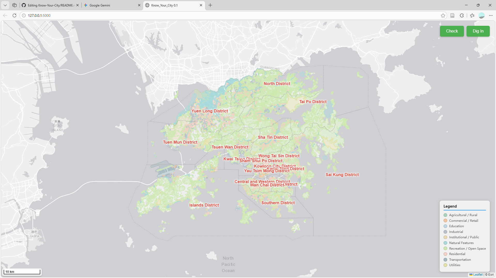
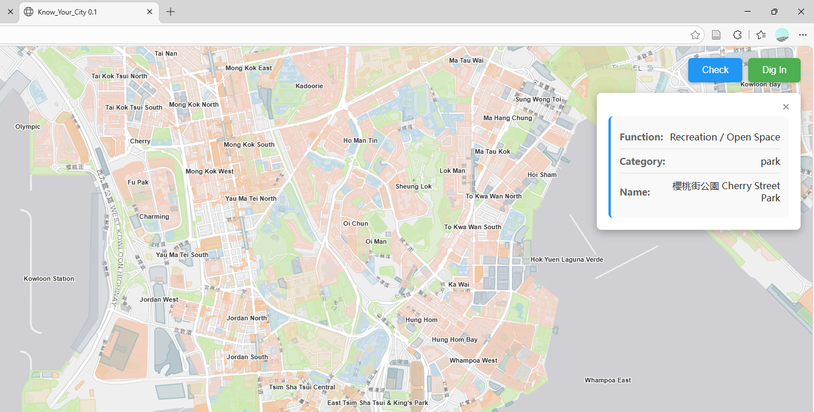
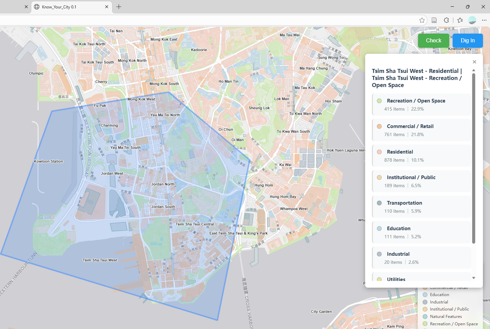
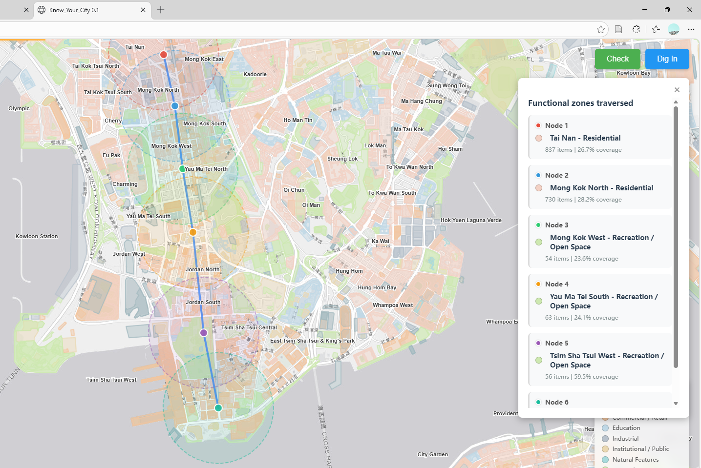
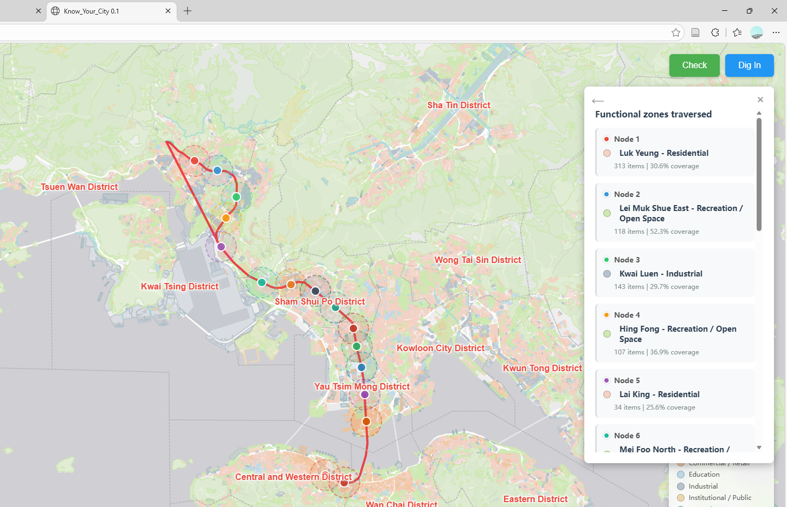

# Know Your City - Interactive Map Analysis Platform

A city functional zone visualization and analysis system based on Flask + Leaflet.js.

## User Experience

### Main Interface
After launching the application, you'll see an interactive map with functional zones displayed in different colors.



### Check Mode - View Feature Details
Click on any feature to view detailed information about functional zones, categories, and names.



### Dig In Mode - Rectangle Analysis
Draw a rectangle to analyze the distribution of functional zones within the selected area.



### Dig In Mode - Polyline Analysis
Draw a polyline to analyze functional zones along the route with 500m buffer zones at each node.



### Dig In Mode - Metro Line Analysis
Select metro lines from the list to analyze functional zones around each station along the route.



## Project Architecture

```
KIRO_Project/
├── app.py                      # Application entry point
├── config.py                   # Configuration file
├── data_loader.py              # Data loading module
├── routes.py                   # API routes
├── preprocess_lod.py           # LOD data preprocessing tool
├── requirements.txt            # Python dependencies
├── static/                     # Frontend resources
│   ├── main.js                 # Main entry
│   ├── map-init.js             # Map initialization
│   ├── map-renderer.js         # Map rendering
│   ├── map-labels.js           # Label display
│   ├── data-loader.js          # Data loading
│   ├── feature-modes.js        # Feature modes
│   ├── ui-controls.js          # UI controls
│   └── style.css               # Styles
└── templates/
    └── index.html              # HTML template
```

## Backend File Descriptions

### `app.py`
**Application Entry Point**
- Initialize Flask application
- Configure HTTP compression (gzip)
- Register routes
- Start web server
- Display startup information

### `config.py`
**Configuration File**
- Define data file paths (Shapefile, GeoJSON)
- LOD (Level of Detail) zoom level configuration
- Functional zone color mapping
- Server parameters (HOST, PORT, DEBUG)

### `data_loader.py`
**Data Loading and Management**
- Load multi-level LOD data (zoom 8-18)
- Load constituency and administrative boundary data
- Load basemap data (roads, waterways, railways, etc.)
- Provide data query interface
- Dynamically return data with appropriate precision based on zoom level
- Filter Unclassified features

### `routes.py`
**API Route Definitions**

Provides the following API endpoints:

- `GET /` - Main page
- `GET /api/load_map` - Load initial map data (boundaries, legend, labels)
- `GET /api/load_admin_boundaries` - Load administrative boundaries (simplified version)
- `POST /api/load_viewport` - Load data based on viewport and zoom level
- `POST /api/analyze_region` - Analyze functional zone distribution in polygon/rectangle area
- `POST /api/analyze_polyline_nodes` - Analyze functional zones in buffer areas along polyline nodes
- `GET /api/get_metro_lines` - Get Hong Kong metro lines from OSM Overpass API

### `preprocess_lod.py`
**LOD Data Preprocessing Tool**
- Generate optimized data for different zoom levels
- Merge small area features
- Simplify geometries
- Reduce data volume and improve performance

## Frontend File Descriptions

### `templates/index.html`
**HTML Template**
- Define page structure
- Map container
- Control buttons (Check / Dig In)
- Information panel
- Legend
- Loading animation and progress bar

### `static/main.js`
**Main Entry File**
- Initialize application
- Coordinate modules
- Set up event listeners
- Start map loading process

### `static/map-init.js`
**Map Initialization**
- Create Leaflet map instance
- Set up basemap layer (OpenStreetMap)
- Configure map parameters (center point, zoom level, max/min zoom)
- Add scale control
- Set up map event listeners (moveend, zoomend)

### `static/map-renderer.js`
**Map Rendering**
- Render GeoJSON data to map
- Apply functional zone color styles
- Handle feature click events
- Manage layer visibility
- Add administrative boundaries

### `static/map-labels.js`
**Label Display**
- Render constituency labels (batch optimized)
- Render administrative district labels
- Control label visibility based on zoom level
- Label style and position management

### `static/data-loader.js`
**Data Loading**
- Fetch data from backend API
- Handle viewport changes
- Implement LOD data loading
- Manage loading state
- Show/hide progress bar

### `static/feature-modes.js`
**Feature Mode Management**

Implements two interaction modes:

**Check Mode (View Mode)**
- Click features to view detailed information
- Display functional zone, category, name and other attributes

**Dig In Mode (Exploration Mode)**
- Draw polygon/rectangle to analyze functional zone distribution in area
- Draw polyline to analyze functional zones along nodes (500m buffer)
- Fetch and select metro lines from OSM for analysis
- Display analysis results and statistics
- Support returning to line selection list
- Clear all drawings and analysis results

### `static/ui-controls.js`
**UI Controls**
- Manage button states (active/inactive)
- Show/hide information panel
- Display status messages
- Control loading animation
- Manage legend display
- Progress bar control

### `static/style.css`
**Style Definitions**
- Map and control styles
- Information panel styles
- Button and toolbar styles
- Legend styles
- Animation effects
- Responsive layout

## Main Features

### 1. Multi-level Data Visualization (LOD)
- Automatically load data with appropriate precision based on zoom level
- zoom 8-10: Highly simplified data
- zoom 12-14: Medium precision data
- zoom 16-18: High precision original data
- Optimize performance and reduce data transfer volume

### 2. Functional Zone Viewing (Check Mode)
- Click map features to view detailed information
- Display functional zone type, category, name and other attributes

### 3. Area Analysis (Dig In Mode)
- Draw polygon or rectangle to select area
- Count the number and proportion of each functional zone in the area
- Display area name (constituency)
- Show results sorted by proportion

### 4. Polyline Buffer Analysis
- Manually draw polyline
- Create 500m buffer for each node
- Analyze main functional zones around each node
- Display place names and functional zone information
- Visualize nodes and buffers

### 5. Metro Line Analysis
- Fetch Hong Kong metro lines from OSM Overpass API
- Display line list (including number of stations)
- Select line for analysis
- Display functional zone distribution at stations along the line
- Support returning to line list
- Display lines and stations on map

## Technology Stack

### Backend
- **Python 3.x**
- **Flask** - Web framework
- **Flask-Compress** - HTTP compression
- **GeoPandas** - Geographic data processing
- **Shapely** - Geometric operations
- **Requests** - HTTP requests

### Frontend
- **Leaflet.js** - Map library
- **Leaflet.Draw** - Drawing tools
- **GeoJSON-VT** - Vector tiles
- **Leaflet.VectorGrid** - Vector grid rendering

## Installation and Running

### 1. Install Dependencies
```bash
pip install -r requirements.txt
```

### 2. Configure Data Paths
Edit `config.py` to set Shapefile data paths

### 3. Generate LOD Data (Optional but Recommended)
```bash
python preprocess_lod.py
```

### 4. Start Application
```bash
python app.py
```

### 5. Access Application
Open browser and visit `http://127.0.0.1:5000`

## Data Requirements

### Shapefile Format
- **Must include** `Func_Group` field (functional zone type)
- Recommended to include `fclass` field (category)
- Recommended to include `name` field (name)
- Coordinate system: WGS84 (EPSG:4326)

### LOD Data Structure
```
data/lod_data/
├── filename_zoom8.shp
├── filename_zoom10.shp
├── filename_zoom12.shp
├── filename_zoom14.shp
├── filename_zoom16.shp
└── filename_zoom18.shp
```

## Performance Optimization

1. **LOD System** - Load data with different precision based on zoom level
2. **Viewport Clipping** - Only load data in visible area
3. **Geometry Simplification** - Use simplified geometries at low zoom levels
4. **Feature Merging** - Merge small area features to reduce data volume
5. **HTTP Compression** - Use gzip to compress response data
6. **Batch Label Rendering** - Optimize label display performance
7. **Dynamic Data Loading** - Load LOD data on demand

## License

MIT License
